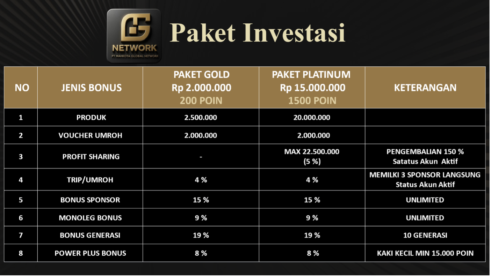
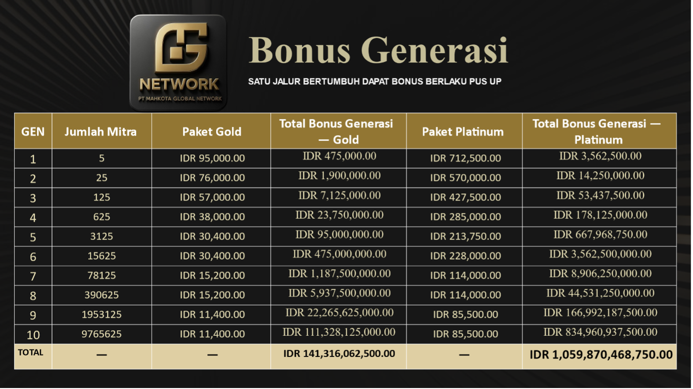
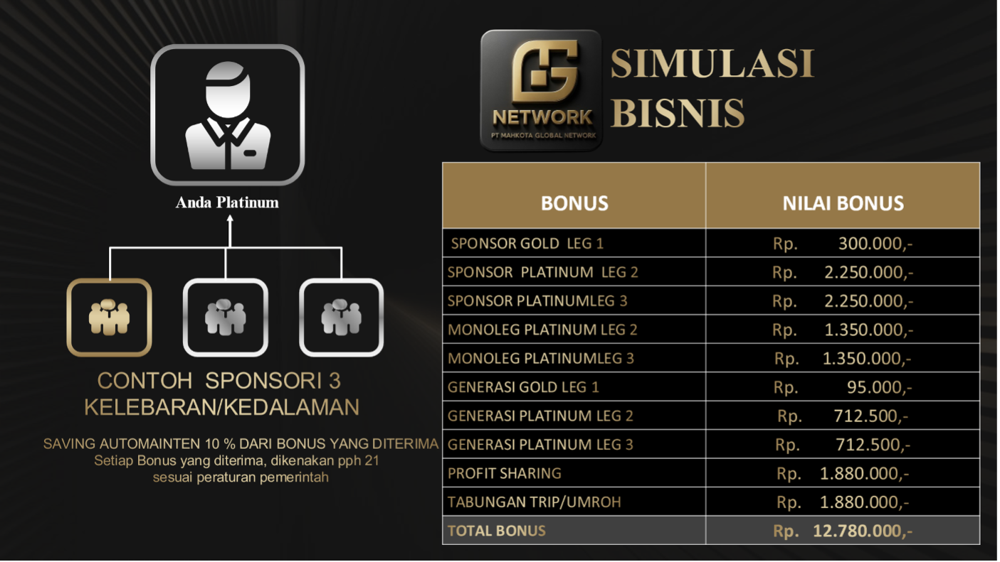

#  MARKETING PLAN PT.MG Net

**PAKET KEMITRAAN DAN JENIS BONUS**

{width="7.0in" height="3.9375in"}

> **◻ STRUKTUR BONUS**

## Bonus Sponsor 15 % (Direct Sponsor Bonus)

- Silver mensponsori Silver → 15% × Rp 2.000.000 = **Rp 300.000**

- Silver mensponsori Platinum → 15% × Rp 15.000.000 = **Rp 2.250.000**

- Platinum mensponsori Silver → 15% × Rp 2.000.000 = **Rp 300.000**

- Platinum mensponsori Platinum → 15% × Rp 15.000.000 = **Rp 2.250.000**

- **Status tidak aktif tetap mendapatkan bonus sponsor**

- **Penempatan jalur sponsorisasi bisa melebar atau kedalaman**

**Contoh :**

+-----------------------------------+
| BONUS                             |
|                                   |
| 1.  Bonus sponsor dari Gold Rp.   |
|     300.000                       |
|                                   |
| 2.  Bonus sponsor dari Platinum   |
|     Rp.2.250.000                  |
+===================================+

ANDA

PLAT

GLOD

## Bonus Generasi 19 % (Unilevel Bonus)

- Berlaku satu jalur bertumbuh (*monoleg system*).

- Besar bonus mengikuti level keanggotaan.

- Jika di bawah Silver terdapat mitra Platinum, selisih generasi akan
  *naik (push-up)* ke upline Platinum di atasnya.

> Tabel berisi 10 generasi aktif. Contoh (GOLD )

- Alokasi bonus Generasi Paket Platinum Rp 15.000.000 x 19 % =Rp.
  2.850.000,-

- Alokasi bonus Generasi Paket Gold Rp. 2.000.000 x 19 % = Rp. 380.000,-

- Bonus per generasi menurun dari 25 % -3 % dari Pay Out Bonus Generasi

- Total akumulasi dihitung dari 10 generasi

- Berlaku Push -up bila dalam 90 hari akun tidak aktif

- Berlaku repeat order

{width="7.0in" height="3.9375in"}

## Bonus Monoleg 9 %

- Diperoleh dari 1 jalur pertumbuhan Satu Garis Kedalaman (leg kanan)

- Berlaku *unlimited depth* dan berlaku repeat order.

- Syarat telah memiliki 1 sponsor langsung

{width="6.447916666666667in"
height="4.835937226596675in"}

## Bonus Power Plus (8 %)

- Diberikan kepada mitra yang:

  - Telah membangun **2 tim aktif (kiri & kanan)** yang disponsori
    langsung.

  - Dibagikan kepada

  - Omzet kaki kecil 15.000 point mendapatkan 4% dibagi jumlah
    qualifiete

  - Omzet kaki kecil 30.000 point mendapatkan 4 % dibagi jumlah
    qualifiete

- Besaran bonus: **5% dari total payout perusahaan.**

## Bonus Profit sharing 5 % (Khusus Platinum)

- Profit Sharing sebesar **5% dari total omzet perusahaan** dihitung
  harian, dibayarkan setiap bulan kepada mitra yang **Aktivasi paket
  Perdana Platinum** tidak berlaku **repeat order.**

- Dana dikumpulkan di **wallet cashback** mitra, maksimal **Rp
  22.500.000.**

- Syarat akun harus aktif

## Tabungan Umroh / Trip (4%) dari Omzet Perusahaan 

- Diberikan kepada mitra yang memiliki minimal **3 tim aktif**
  (disponsori langsung).

- Berlaku untuk semua paket bisnis **Gold & Platinum**.

- Akun Wajib dalam status aktif

- Besaran tabungan diterima max Rp. 50.000.000 pertahun

- Tidak dapat di uangkan

- Bisa memilih paket trip yang tersedia sesuai di tabel KLAIM

- Dapat di klain untuk mengikuti event perusahaan

# MASA AKTIF & MAINTENANCE

- Masa aktif awal: **45 hari sejak tanggal join untuk paket Gold dan 90
  hari Platinum**

- Untuk memperpanjang masa aktif 45 hari berikutnya, mitra harus:

  1.  Melakukan **repeat order** / automaintain minimal paket **GOLG**
      atau

  2.  **Mensponsori 2 orang baru** dalam masa aktif.

- Setelah memenuhi salah satu syarat, masa aktif otomatis diperpanjang.

# ATURAN SPONSOR & PENEMPATAN

1.  Sponsor pertama **harus ditempatkan di sisi kiri.**

2.  Jika terjadi limpahan (*spillover*) dari upline, tetap ditempatkan
    di jalur kiri.

3.  Setelah memenuhi syarat sponsor pertama, mitra bebas menempatkan
    calon mitra baru di sisi kanan atau kiri.

# ATURAN REPEAT ORDER PAKET

1.  **PLATINUM Rp. 12.750.000,-**

2.  **PAKET GOLD Rp. 1.700.000,-**

3.  **Repeat order bisa dengan cara a. belanja ulang full**

> **b. dari Automaintain**

{width="7.0in" height="3.9375in"}
